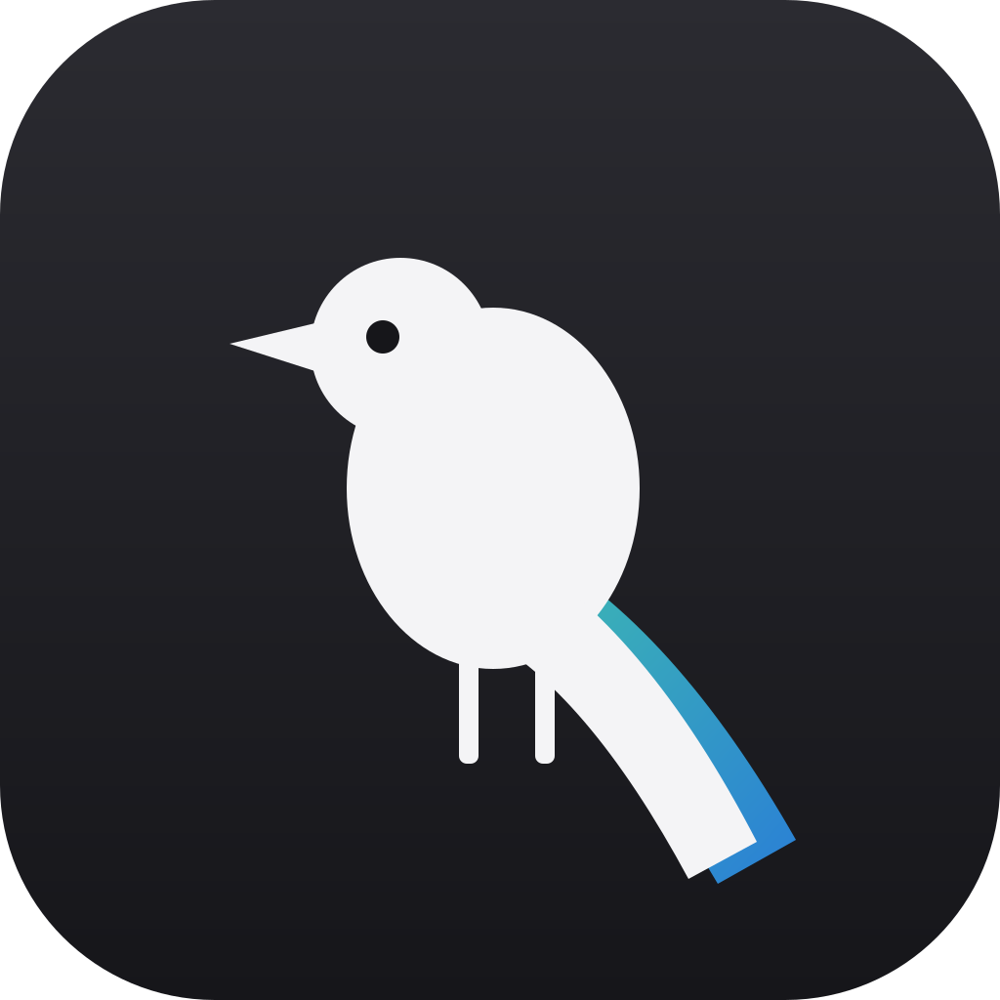
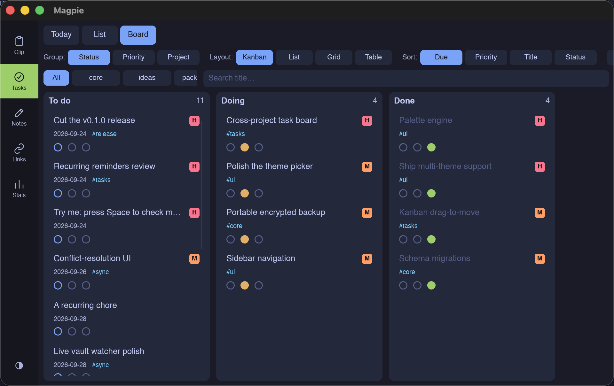
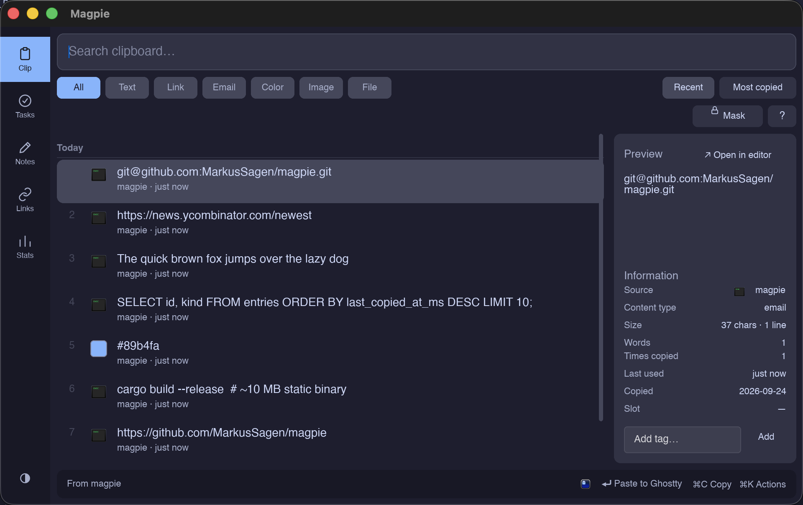
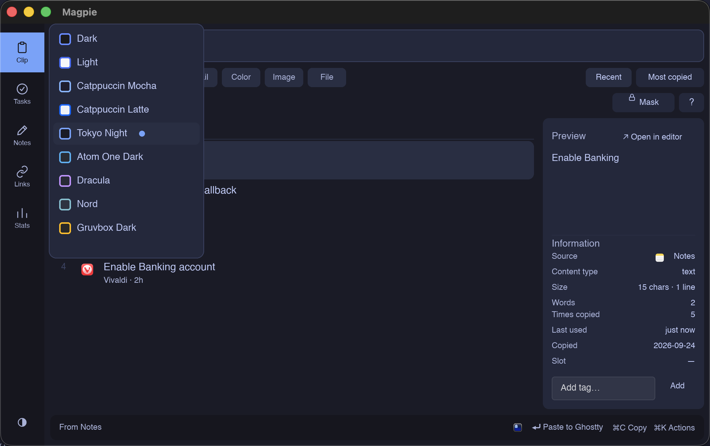
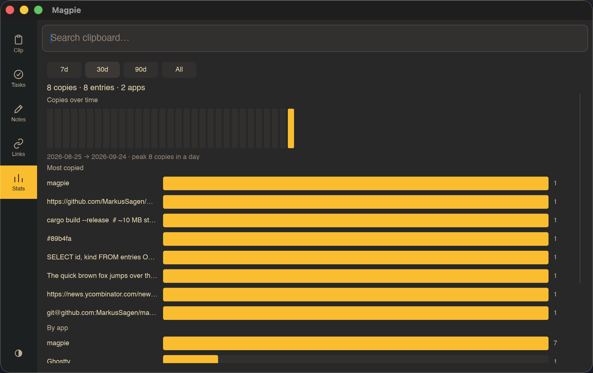

<div align="center">



# Magpie

### Your clipboard, notes, tasks, bookmarks and time — one local-first, native app.

Keyboard-first. Fully private. Cross-platform. A single **~10 MB** binary — Rust + [Slint](https://slint.dev), **no webview, no cloud, no telemetry.**

<br/>

[](https://github.com/MarkusSagen/magpie/actions/workflows/ci.yml)
[](https://github.com/MarkusSagen/magpie/releases)


<br/>



</div>

---

It started as a clipboard manager. Then it grew into the thing that lives on your `⌘⇧Space`
— the one window you reach for to paste, jot, plan, and track, all without a single byte
leaving your machine. Everything is stored in a **local, encrypted database** and mirrored
to plain **Markdown** you own.

## Highlights

- **Clipboard that remembers** — full history with live search (exact / fuzzy / regex), type
  filters, **source-app attribution**, copy counts, pinning, and `⌘1–9` quick-paste.
- **Notes, org-flavored** — `[[wiki-links]]`, daily notes, backlinks, `#tags`, and a
  connection graph. Your notes are the source of truth.
- **Tasks inside notes** — `- [ ]` lines with inline `!priority @due #project +recur`, a
  cross-project **Kanban board** (List / Grid / Table / Kanban), reminders that fire even when
  the app is closed, and **org-mode `CLOCK:` time tracking**.
- **Bookmarks** — save any link with favicons and preview thumbnails; browser import included.
- **Analytics** — copies-over-time, most-copied, per-app and per-type breakdowns, and time reports.
- **9 built-in themes** — Catppuccin, Tokyo Night, Dracula, Nord, Gruvbox, Atom One, and light/dark.
- **Private by design** — SQLCipher at rest, secret-aware capture, and a two-way Markdown vault.

## A look inside

<table>
<tr>
<td width="50%" valign="top">
<br/>
<sub><b>Clipboard.</b> Search-as-you-type, type filters, live color swatches, and a detail pane that shows where each copy came from.</sub>
</td>
<td width="50%" valign="top">
<br/>
<sub><b>Themes.</b> Nine palettes, applied instantly across every surface — including the menu-bar popover and native window chrome.</sub>
</td>
</tr>
<tr>
<td width="50%" valign="top">
<br/>
<sub><b>Tasks.</b> Every <code>- [ ]</code> across your notes, on one board — group by status/priority/project, four layouts, drag to move.</sub>
</td>
<td width="50%" valign="top">
<br/>
<sub><b>Stats.</b> Real usage analytics — copies over time, most-copied, by app, by type, and time tracked per project.</sub>
</td>
</tr>
</table>

## Why Magpie

The clipboard history was inspired by Raycast — Magpie closes its gaps and keeps going:

- **Nothing expires, nothing is paywalled.** Your history stays until *you* clear it.
- **Real search & filtering** — word-mode by default, an exact / fuzzy / regex toggle, and
  filtering by source app, time range, and content type.
- **It's a hub, not a feature.** Clipboard, notes, tasks, bookmarks, and time in one place,
  reachable from anywhere with a global hotkey.
- **Your data is yours** — one local file, encrypted, plus a Markdown vault you can open in
  Obsidian, Logseq, or `vim`.

## Platforms

| | Clipboard | Source app | Auto-paste | Autostart | Notifications |
|---|:---:|:---:|:---:|:---:|:---:|
| **macOS** | yes *(+ concealed-type)* | yes | yes *(Accessibility)* | LaunchAgent | UNUserNotificationCenter |
| **Windows** | yes | yes | yes | Registry Run key | Toast |
| **Linux (X11)** | yes | yes | yes | XDG autostart | D-Bus |
| **Linux (Wayland)** | yes | *often "Unknown"* | yes | XDG autostart | D-Bus |

CI builds and tests all three OSes on every push. Wayland hides other apps' identity (source
falls back to "Unknown"); macOS auto-paste needs a one-time Accessibility grant.

## Install

Grab a build from the [latest release](https://github.com/MarkusSagen/magpie/releases)
(`.app` zip for macOS, `.tar.gz` for Linux, `.zip` for Windows), or build from source:

```bash
mise install          # sets up Rust + just (or bring your own stable Rust)
just release          # optimized ~10 MB binary at target/release/magpie
just package-macos    # assemble target/Magpie.app (unsigned)
```

> macOS builds are unsigned — first launch: right-click the app → **Open**.

## Run

```bash
./target/release/magpie                       # run the tray/menu-bar app
./target/release/magpie --install-autostart   # start at login
```

Summon the launcher with `⌘⇧Space` (configurable). Inside: `Enter` pastes into the focused
app, `⌘/Ctrl+Enter` copies without pasting, `⌘K` opens actions, and a bare `g` leads
section jumps (clipboard · tasks · notes · bookmarks · stats).

## Privacy

Magpie is **fully local** — no network, no telemetry. Sensitive copies are skipped at the
capture layer, before anything is stored:

- **OS/app secret markers** — macOS `ConcealedType`/`TransientType`, Windows
  `ExcludeClipboardContentFromMonitorProcessing`, Linux `x-kde-passwordManagerHint`.
- **App denylist** — password managers (1Password, Bitwarden, KeePassXC) by default.
- **Content-regex ignore** — AWS keys, private keys, and JWT-shaped strings.
- **Encryption at rest** — the database is SQLCipher-encrypted; the key lives in your OS
  keychain. Pause capture any time.

## Architecture

A Cargo workspace of three crates:

- **`magpie-core`** — pure Rust: SQLCipher storage (WAL + FTS5, dedup, event log, migrations),
  content detection, search, notes/tasks parsing, vault reconcile. No OS or UI; fully tested.
- **`magpie-platform`** — OS clipboard/window/hotkey/paste/autostart/notifications behind traits
  with a cfg-selected factory. Decision logic is pure and tested; adapters keep FFI thin.
- **`magpie-app`** — the Slint launcher, menu-bar popover, tray, and runtime wiring.

Contributions and hacking welcome — see [`CLAUDE.md`](CLAUDE.md) for the developer guide
(toolchain, debugging, and hard-won gotchas).
